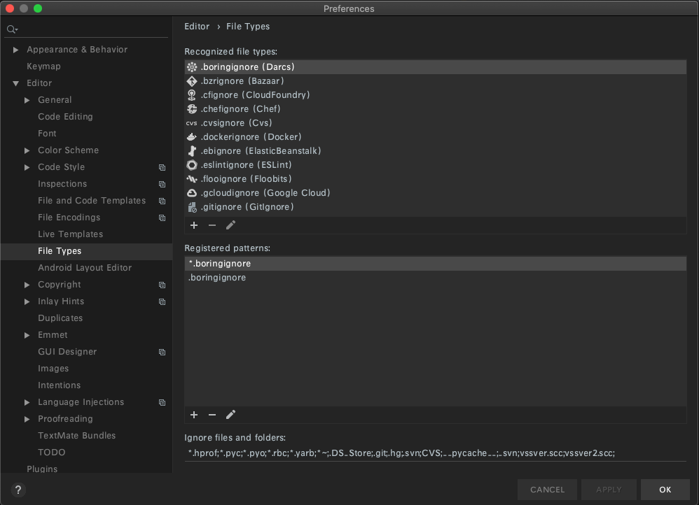

# IntelliJ error
### 문제 상황
- `SecurityProperties.java` 생성 하는데 java 파일로 인식 못하고 일반 파일로 생성 되면서 아래와 같은 에러 팝업 뜸.
```text
Cannot Create Class 
Unable to parse template "Class"

Selected class file name 'SecurityProperties.java' mapped to 
not java file type 'Files supported via TextMate bundles'
```

### 삽질
- 다른 파일명은 생성 가능한데 `SecurityProperties`만 에러.
- IntelliJ 전부 종료하고 재실행해도 해결 안 됨.
- [https://neojjc.tistory.com/5](https://neojjc.tistory.com/5) 링크의 방법도 해봤지만 해결 안 됨.
- 프로젝트 날리고 다시 github에서 clone 받아 실행해봤지만 해결 안 됨.

### 해결
- `Preferences`(단축키 `⌘,`) → Editor → File Types \

- 우측 하단 `Registered Patterns`에 `SecurityProperties.java` 추가하고 apply
- 다시 제거하고 apply
- IntelliJ 재실행 하니 됨.
- 원인은 알지 못함.
