# Notion - Google Hangouts Chat Webhook 알림 설정하기 (with Automate.io)
- Notion 으로 업무 태스크 관리를 하고 있다.
- API 명세를 페이지로 뽑아 개발팀 내에서 협업할 때 사용하고 있는데,
  프론트엔드 개발자님이 스쳐지나가는 말로 "아, 노션도 행아웃에 업데이트 알림이 오면 좋은데." 하셔서
  방법이 없을까 생각하다가 `Automate.io`라는 서비스를 찾아냈다.
- https://automate.io/

---

# 👉 연동할 Notion Database 예제
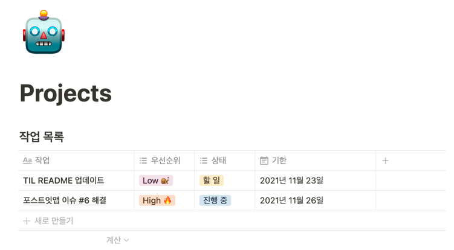

# 👉 요구사항
- Database 가 업데이트 되면 행아웃 채팅방에 알림이 온다.
- 자세한 내용까지는 아니더라도 최소한 상태(할 일, 진행 중, 완료) 변경을 알 수 있다.

# 👉 설정하기
## 1. Automate.io 가입
- https://automate.io/

## 2. Notion App 연결
- `Apps` - `Add a New App` \
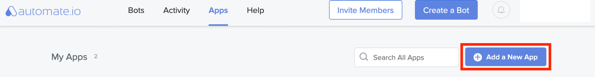
- "Notion" 검색하여 클릭 \
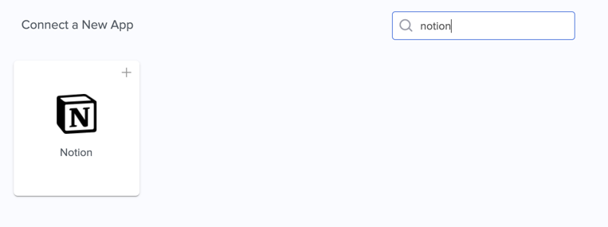
- 원하는 App Name 입력 \
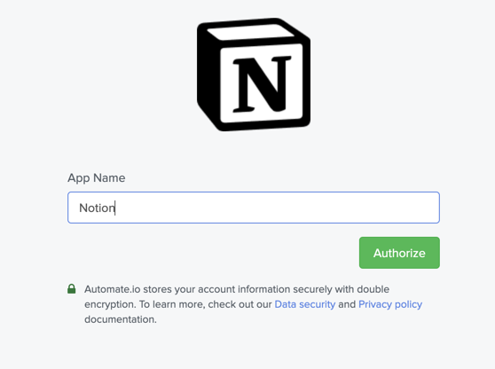
- Notion 계정, Workspace 확인 \
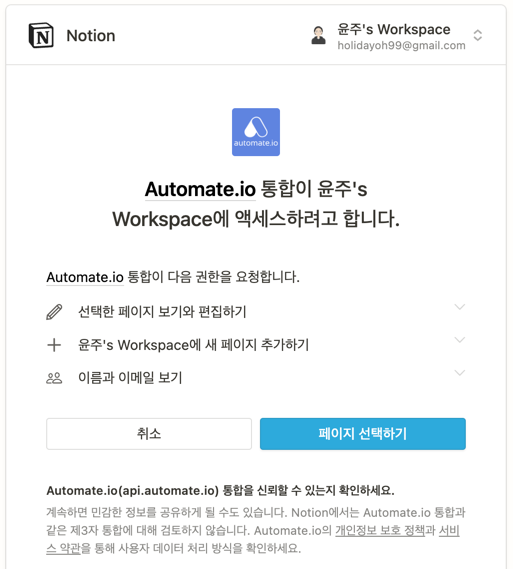
- 액세스 허용할 페이지 선택 \
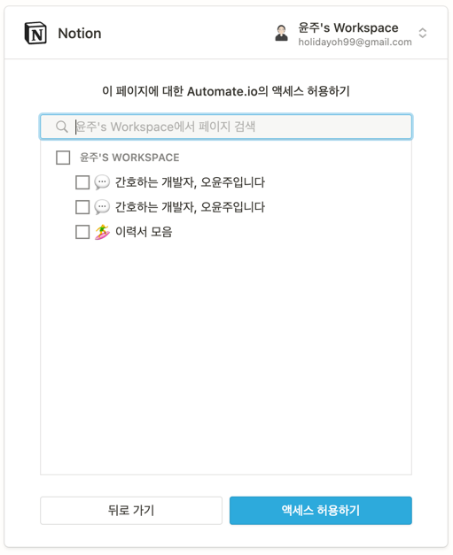
- `액세스 허용하기` - Authentication Successful 페이지 나오면 `Save`

## 3. Google Hangouts chat App 연결
- `Apps` - `Add a New App` \
  
- "Google Hangouts chat App" 검색하여 클릭 \
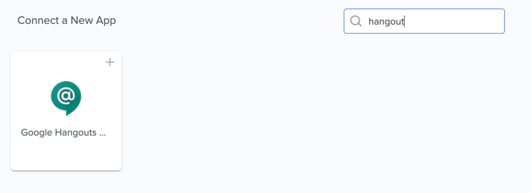
- 원하는 App Name 입력
- 원하는 Google 계정 선택 \
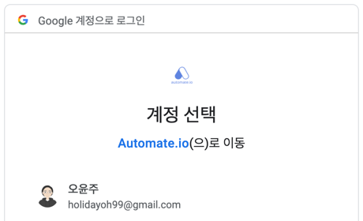
- Authentication Successful 페이지 나오면 `Save`

## 4. Google Hangouts chat 웹훅 추가
- 웹훅 추가할 채팅방에 들어가서 상단 채팅방 이름 클릭 - 웹훅 관리 \
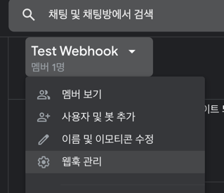
- 원하는 이름 입력 - 저장 \
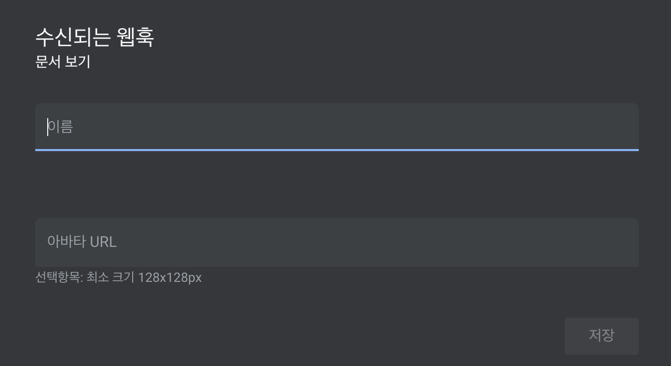
- ⭐️ 웹훅 주소 복사해두기

## 5. Bot 생성
### 5-1, `Bots` - `Create a Bot`
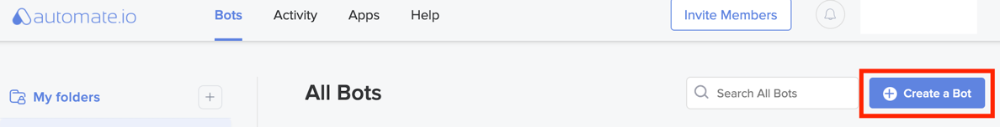

### 5-2. Trigger 설정
- 위에서 생성한 Notion App 선택 \
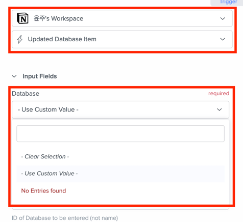
- 원하는 Trigger 선택.
  - 데이터베이스 아이템이 생성될 때, 체크리스트 아이템이 완료됐을 때 등 몇 가지 선택지가 있다.
- `Input Fields` 에 대상이 될 데이터베이스를 선택한다.
  - 근데 연동한 페이지 내에 데이터베이스가 있음에도 `No Entries found`라며 select box 목록에 안 뜰 때가 있다.
  - 그럴 땐 `Use Custom Value` 선택해서 아래 input box 에 데이터베이스 ID를 입력하면 연결된다.
    - 데이터베이스 ID 는 해당 데이터베이스의 링크를 보면 알 수 있다.
    - `https://www.notion.so/<username>/<hash1>?v=<hash2>` : `hash1` 값이 ID

### 5-3. Action 1 설정
- 오른쪽 + 버튼 클릭
- 위에서 생성한 Hangouts Chat App, Send Message 선택 \
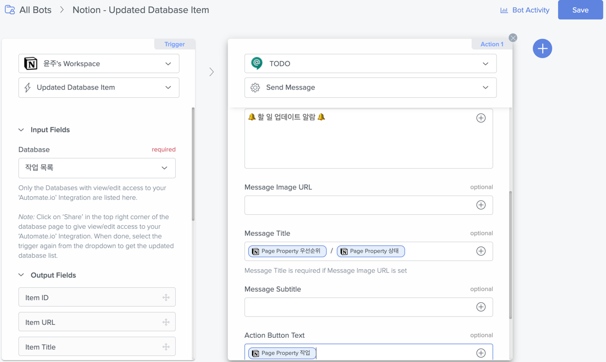
- Webhook URL 에 아까 복사해둔 주소 붙여넣기
- Message Text 등등 원하는 대로 지정한다.
- 참고로, optional 들은 아래와 같이 설정하면 \
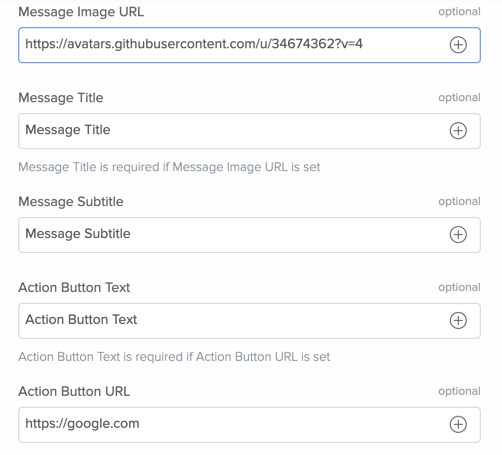
- 이렇게 보인다. \
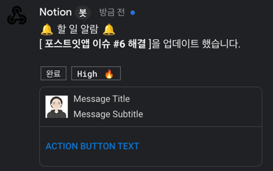

### 5-4. Save
- 오른쪽 상단 `Save` 버튼 클릭
- `Your Bot is currently OFF Turn it ON` 페이지 뜨면 ON 해준다.

## 6. 테스트
- Database 를 업데이트 한다.
  - 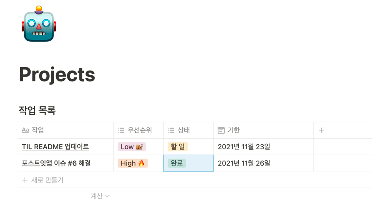
  - `포스트잇앱 이슈 #6 해결`의 상태를 `진행 중` -> `완료`로 변경함.
- `I'm Done` \
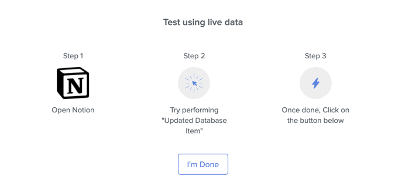
- 알림 메시지 확인 \
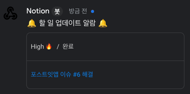
- 완료 \

---

- 참고로 무료 플랜은 아래와 같은 제약 사항이 있다. \
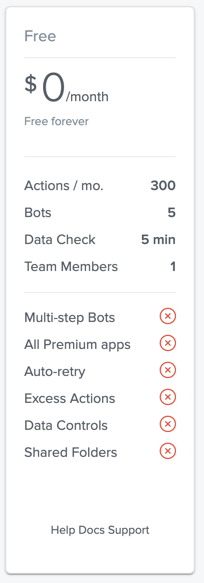
- https://automate.io/app/plans
