# 슬랙 앱 만들기

# 👉 1. 봇 생성
- https://api.slack.com/

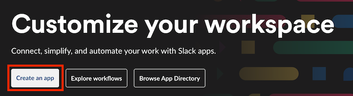

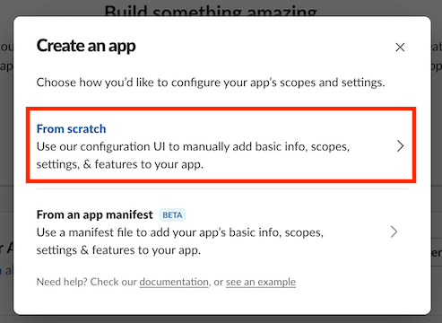

- App Name 입력, workspace 선택

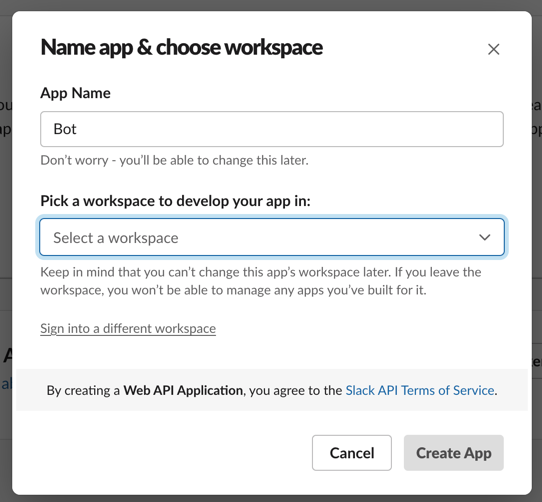

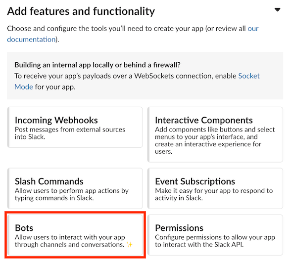

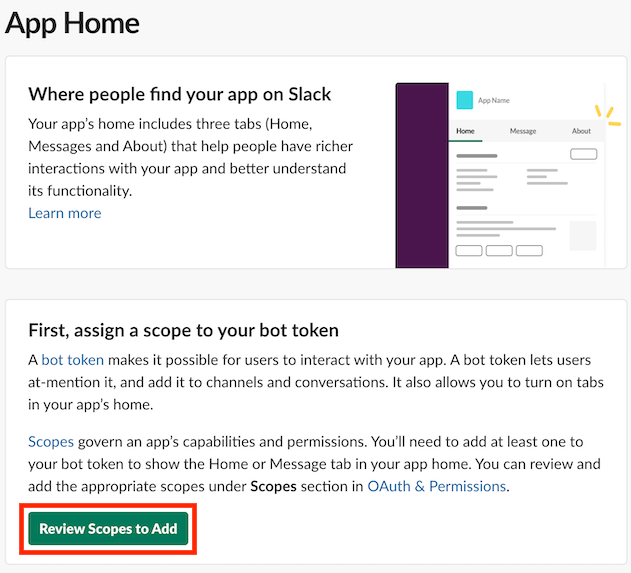

- OAuth & Permissions 페이지 밑에 내려보면 `Scopes`이 있다. 
- Bot token Scopes 눌러서 필요한 권한을 선택해준다.

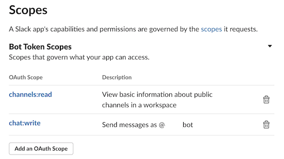

| OAuth Scope   | Description        |
|---------------|--------------------|
| channels:read | public 채널 정보 조회 권한 |
| chat:write    | 메시지 발송 권한          |

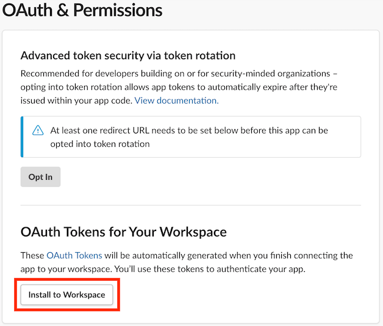

- Access 페이지 나오면 allow 눌러준다.
- 그럼 token 이 생성되는데, 필요하니 복사해두자.

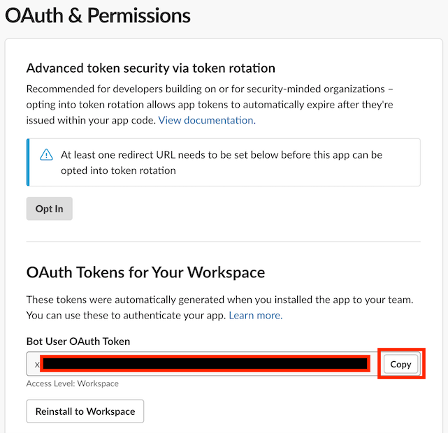

# 👉 채널 생성 및 앱 연결, 채널 정보 얻기
- 채널 생성은 생략. 
- ###⭐️ 단, 반드시 공개 채널로 생성할 것!

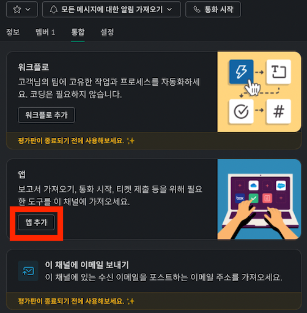

- 채널 이름 클릭하면 모달 하나 뜨는데, 통합 탭에서 앱 추가를 해준다.
- 그리고 위에서 만들어준 봇을 연결한다.

- 테스트 해본다
- https://api.slack.com/methods/conversations.list/test

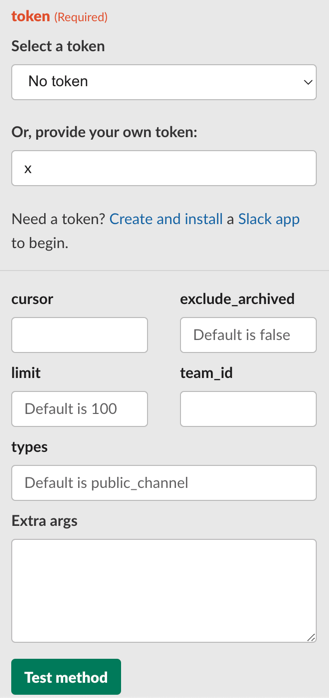

- 아까 복사해둔 token 넣고 `Test method` 버튼 클릭
- 그럼 json 형태로 채널 목록 응답값이 오는데, 봇 연결한 채널 찾아서 id 값을 알아둔다.

# 👉 Chat API 테스트
- https://api.slack.com/methods/chat.postMessage/test

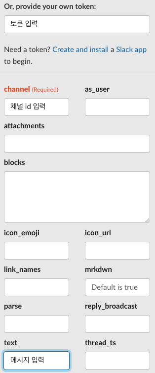

- 토큰과 채널 id, text 를 넣고 테스트 돌려서 슬랙에 메시지가 오는지 확인한다.

# 👉 코드 작성
- https://api.slack.com/messaging/sending
- 이 문서를 참고 했다.
