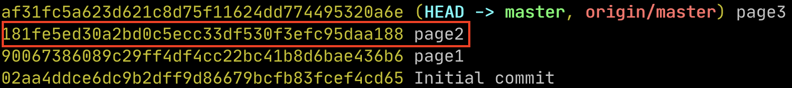
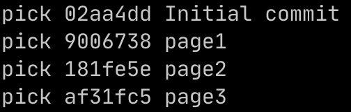
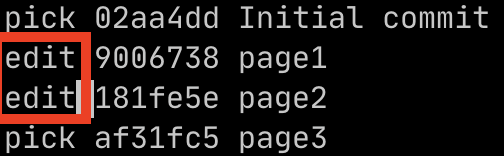

# Commit history | Author, Committer 변경
## rebase -i 이용
### log author, committer 확인
```git
git log --pretty=fuller
```

### rebase -i
```git
git rebase -i {체크섬}
```
- `체크섬` : 변경 하려는 커밋의 직전 커밋 체크섬
    - ex) 
    - `181fe5` 커밋을 변경 하려면
        ```git
        git rebase -i 900673
        ```
    - 최초 커밋 변경 하려면
        ```git
        git rebase -i --root
        ```
- 변경 하고자 하는 커밋 `pick` → `edit`
- 
- 
- 명령어 모드에서 저장, 나가기(`:wq`)

##### (* rebase 관련 자세한 정보는 다음 참고 : https://git-scm.com/docs/git-rebase)

### 변경
```git
git -c user.name="{user.name}" -c user.email="{user.email}" commit --amend --reset-author;
```
- 편집기 열지 않고 바로 적용하려면 위 명령어에 `--no-edit` 옵션 추가
- 다음 커밋 지점으로 이동
```git
git rebase --continue
```
- 마지막 커밋 수정 지점까지 완료하면 아래 문구 나옴.
```git
Successfully rebased and updated ~
```
- `git log --pretty=fuller` 명령어로 로그 다시 확인해보면 바뀌어 있을 것.

### Remote repository에 적용
```git
git push -f {remote name} {branch name}
```
- 기존 커밋을 변경했으므로 강제 push 해서 덮어쓰기 위해 `-f` 옵션 추가해야 함.

---

## 가장 마지막 커밋 하나만 변경한다면
- rebase 필요 없이 바로 아래 명령어 사용
```git
git -c user.name="{user.name}" -c user.email="{user.email}" commit --amend --reset-author;
```

## 여러 건을 변경하려면
```git
git filter-branch --env-filter '
OLD_EMAIL="{변경 전 이메일}"
CORRECT_NAME="{변경 후 user.name}"
CORRECT_EMAIL="{변경 후 user.email}"
if [ "$GIT_COMMITTER_EMAIL" = "$OLD_EMAIL" ]
then
    export GIT_COMMITTER_NAME="$CORRECT_NAME"
    export GIT_COMMITTER_EMAIL="$CORRECT_EMAIL"
fi
if [ "$GIT_AUTHOR_EMAIL" = "$OLD_EMAIL" ]
then
    export GIT_AUTHOR_NAME="$CORRECT_NAME"
    export GIT_AUTHOR_EMAIL="$CORRECT_EMAIL"
fi
' --tag-name-filter cat -- --branches --tags
```
- Reference : [stackoverflow - How to change the author and committer name and e-mail of multiple commits in Git?](https://stackoverflow.com/questions/750172/how-to-change-the-author-and-committer-name-and-e-mail-of-multiple-commits-in-gi/4903673)
- `주의` : 커밋을 다시 쓰기 때문에 체크섬이 변경됨.
