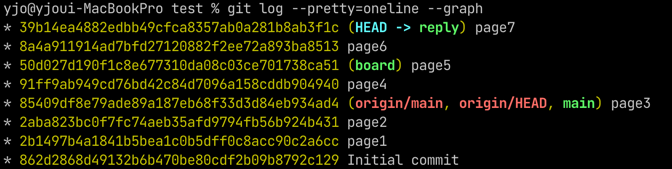
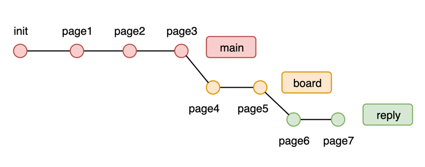
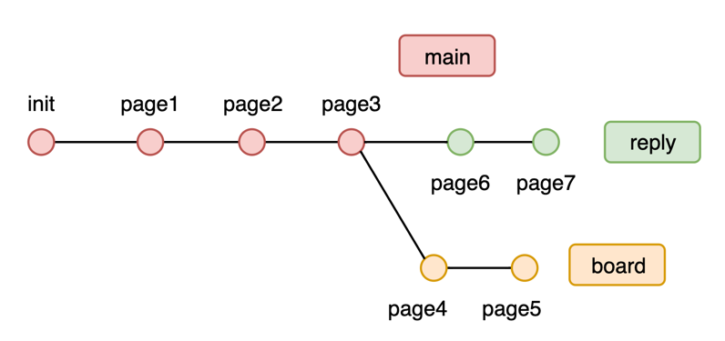
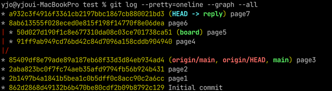

# git rebase --onto
## : 다른 토픽 브랜치에서 갈라져 나온 토픽 브랜치를 rebase 하기

# 상황
- 아래와 같은 로그가 있다.

 \


- `board` 브랜치를 push 하기 전, `reply` 브랜치만 먼저 반영하려고 한다.
- 원하는 건 아래와 같은 그림.



- 하지만 rebase 를 사용하면 원하는 대로 동작하지 않는다.
```commandline
git checkout reply
git rebase main

// Current branch reply is up to date.
```

# git rebase --onto
```commandline
git rebase [--onto <new base>] [<upstream> [<branch>]]
```

### 적용
```commandline
git rebase --onto main board reply
```
- `main` 마지막 커밋(85409df)부터 `board`와 `reply` 브랜치의 공통 조상(50d027d)까지의 커밋을
  `reply` 브랜치에서 제거



### ※ 공통 조상 찾기
```commandline
git merge-base <commit> <commit> ...
git merge-base <branch> <branch> ...
```

- 참고 : [Git Documentation : 3.6 Git 브랜치 - Rebase 하기](https://git-scm.com/book/ko/v2/Git-%EB%B8%8C%EB%9E%9C%EC%B9%98-Rebase-%ED%95%98%EA%B8%B0)
