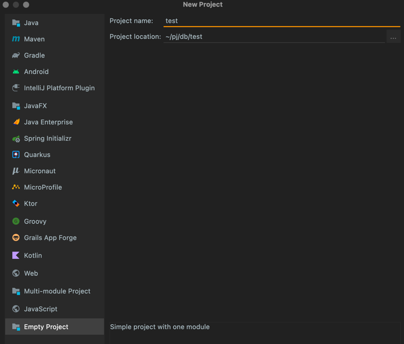
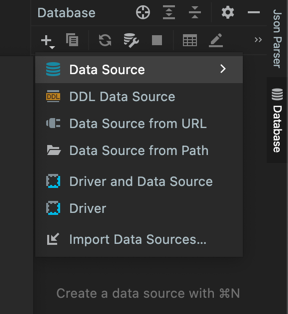
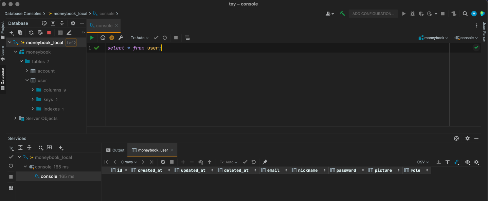

# IntelliJ 를 DataGrip 처럼 사용하기
- DataGrip 라이선스가 만료되었다.
- 새로 구입할까 하다가 DataGrip 을 그렇게 깊게 사용하고 있지 않다는 생각이 듦.
- 다른 DB tool 도 써볼까 하다가 JetBrains 에 길들여진 노예라 고민.
- IntelliJ 를 DB tool 로 가볍게 쓸 수 있다기에 세팅해본다.

---

- New Project - Empty Project

- 우측 Database - + 버튼 - Data Source - 원하는 DB 선택

- Database 탭을 좌측으로 옮겨놓고 쓰면 더 편하다.
- 이후 세팅은 DataGrip 과 사용법 동일.

