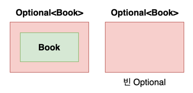

# java.util.Optional<T>
- 값을 캡슐화하는 클래스 \

- 값이 있으면 감싸고, 없으면 Optional.empty 메서드로 Optional 반환
- 값이 없을 수 있음을 명시적으로 나타냄
   - 타입 `Book`은 null이 올바른 값인지 아닌지 판단할 정보가 없음


## Optional 객체 생성

### 빈 Optional
##### `Optional.empty()`
```java
Optional<Book> book = Optional.empty();
```

### null이 아닌 값으로 Optional 생성
##### `Optional.of(value)`
```java
Optional<Book> book = Optional.of(book);
```

### null 값으로 Optional 생성
##### `Optional.ofNullable(value)`
```java
Optional<Book> book = Optional.ofNullable(book);
```
- ofNullable 메서드를 보면,
```java
public static <T> Optional<T> ofNullable(T value) {
    return value == null ? empty() : of(value);
}
```
- value가 null이면 `empty()`로 빈 Optional 객체 반환
- value가 null이 아니면 `of()`로 Optional 객체 반환
- 고로, value가 null일지 아닐지 모를 땐 `ofNullable()` 사용

```java
Optional<Book> book = Optional.ofNullable(null);
System.out.println(book);                          // Optional.empty
Optional<Book> book2 = Optional.of(null);  // NullPointerException
```


## Optional이 담고 있는 객체의 값에 접근
```java
class Book { 
    private final String title;
    private final Optional<Bookmark> bookmark;

    public String getTitle() {
    	return title;
    }
    public Optional<Bookmark> getBookmark() {
        return bookmark;
    }
}

class Bookmark {
    private String color;

    public String getColor() {
    	return color;
    }
}
```
```java
Optional<Book> optBook = Optional.ofNullable(book);
```

#### ❓`optBook`의 title 값에는 어떻게 접근할까?

### map()
```java
Optional<String> title = optBook.map(Book::getTitle);
```

#### ❓`optBook`의 `Bookmark`의 color 값에는 어떻게 접근할까?
- ⚠️ Error
```java
Optional<String> color = optBook.map(Book::getBookmark)
        .map(Bookmark::getColor);  // ⚠️ Error
```
- `optBook.map(Book::getBookmark)`은 `Optional<Optional<Bookmark>>`타입의 객체를 반환하기 때문
### flatMap()
```java
Optional<String> color = optBook.flatMap(Book::getBookmark)
				.map(Bookmark::getColor);
```

### get()
- 값이 없으면 `NoSuchElementException` 발생
- 값이 반드시 있다고 확신할 수 있는 상황에만 사용하는 것이 좋음.
   - 값이 null인지 확인해야 한다면 기존 null 체크 방식과 다르지 않음.
```java
Book book = optBook.get();
```

### orElse(T other)
- 값이 없으면 기본값 반환
```java
String color = optBook.flatMap(Book::getBookmark)
        .map(Bookmark::getColor)
        .orElse("없음");
```

### orElseGet(Supplier<? extends T> supplier)
- 값이 없으면 Supplier에서 제공하는 값 반환

### orElseThrow(Supplier<? extends X> exceptionSupplier)
- Optional이 비어있을 때 Exception 발생
- 단, get()과는 다르게 Exception을 선택할 수 있다.
```java
String color = optBook.flatMap(Book::getBookmark)
        .map(Bookmark::getColor)
        .orElseThrow(NullPointerException::new);
```

### ifPresent(Consumer<? super T> action)
- 값이 존재하면 action 실행
```java
optBook.ifPresent(System.out::print);
```

## 정리
Method | 값이 있을 때 | 값이 없을 때
--- | --- | ---
empty | 빈 Optional 반환
of | 값을 감싼 Optional 반환 | NullPointerException
ofNullable | 값을 감싼 Optional 반환 | 빈 Optional 반환
map | 
flatMap | 파라미터로 주어진 함수를 적용한 Optional 반환 | 빈 Optional 반환
get | Optional이 담고 있는 값 반환 | NoSuchElementException
orElse | 값 반환 | 기본값 반환
orElseGet | 값 반환 | Supplier에서 제공하는 값 반환
orElseThrow | 값 반환 | Supplier에서 생성한 예외 발생
ifPresent | 지정된 Consumer 실행 | 아무 일도 일어나지 않음
isPresent | true 반환 | false 반환

##### * References
   - Modern Java in Action - 라울-게이브리얼 우르마 외 / 한빛미디어
   - https://docs.oracle.com/javase/8/docs/api/java/util/Optional.html
   