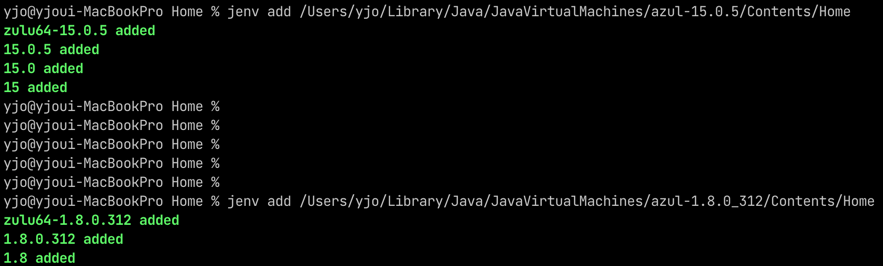
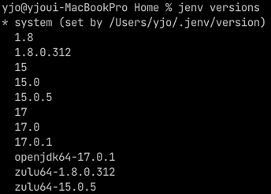
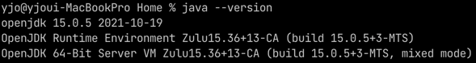

# jEnv 로 여러 버전 자바 관리하기
- 전제 조건
  - macOS, `brew`가 설치되어 있음.

---

## 👉 jEnv 설치
```text
$ brew install jenv
```
- 아래와 같이 뜬다. 그대로 해준다.
```text
To activate jenv, add the following to your ~/.zshrc:
  export PATH="$HOME/.jenv/bin:$PATH"
  eval "$(jenv init -)"
```
- 반영하기
```text
$ source ~/.zshrc
```

## 👉 JDK 버전 확인
```text
$ jenv versions

* system (set by /Users/yjo/.jenv/version)
```
- jEnv 를 처음 설치하고 나서는, JDK 가 설치되어 있더라도 jEnv 에 등록하지 않았으므로
  그냥 `system`으로 나온다.

## 👉 brew 로 JDK 설치하기
- 저장소 추가
```text
$ brew tap adoptopenjdk/openjdk
```
- 설치할 수 있는 버전 확인
```text
$ brew brew search jdk
```
- 설치 (원하는 버전)
```text
brew install --cask adoptopenjdk8
```

## 👉 설치되어 있는 JDK 버전 확인
```text
$ /usr/libexec/java_home -V

17.0.1 (x86_64) "Oracle Corporation" - "OpenJDK 17.0.1" /Users/yjo/Library/Java/JavaVirtualMachines/openjdk-17.0.1/Contents/Home
15.0.5 (arm64) "Azul Systems, Inc." - "Zulu 15.36.13" /Users/yjo/Library/Java/JavaVirtualMachines/azul-15.0.5/Contents/Home
1.8.0_312 (x86_64) "Azul Systems, Inc." - "Zulu 8.58.0.13" /Users/yjo/Library/Java/JavaVirtualMachines/azul-1.8.0_312/Contents/Home
```

## 👉 jEnv 에 등록해주기
```text
$ jenv add <JDK_PATH>
```
- 위에서 확인했던 JDK 경로 입력해주면 된다.
- 난 openjdk-17.0.1, azul-15.0.5, azul-1.8.0_312 세 개 등록해줌.
```text
jenv add /Users/yjo/Library/Java/JavaVirtualMachines/openjdk-17.0.1/Contents/Home
jenv add /Users/yjo/Library/Java/JavaVirtualMachines/azul-15.0.5/Contents/Home
jenv add /Users/yjo/Library/Java/JavaVirtualMachines/azul-1.8.0_312/Contents/Home
```

- 확인 \


## 👉 자바 버전 변경하기
- 전역 설정
```text
$ jenv global <VERSION>
```
- 특정 디렉토리에 대해 로컬 설정 가능
```text
$ jenv local <VERSION>
```

---

## 👀 결과 확인
- 원래 설치되어 있던 버전은 17.0.1 \

- `jenv global 15.0.5` 명령어 사용 \

