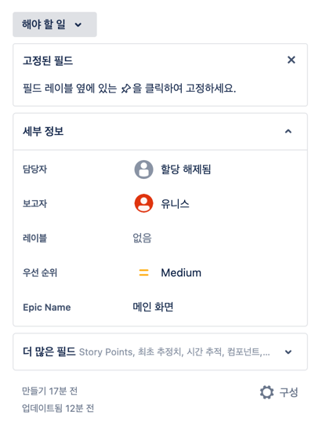
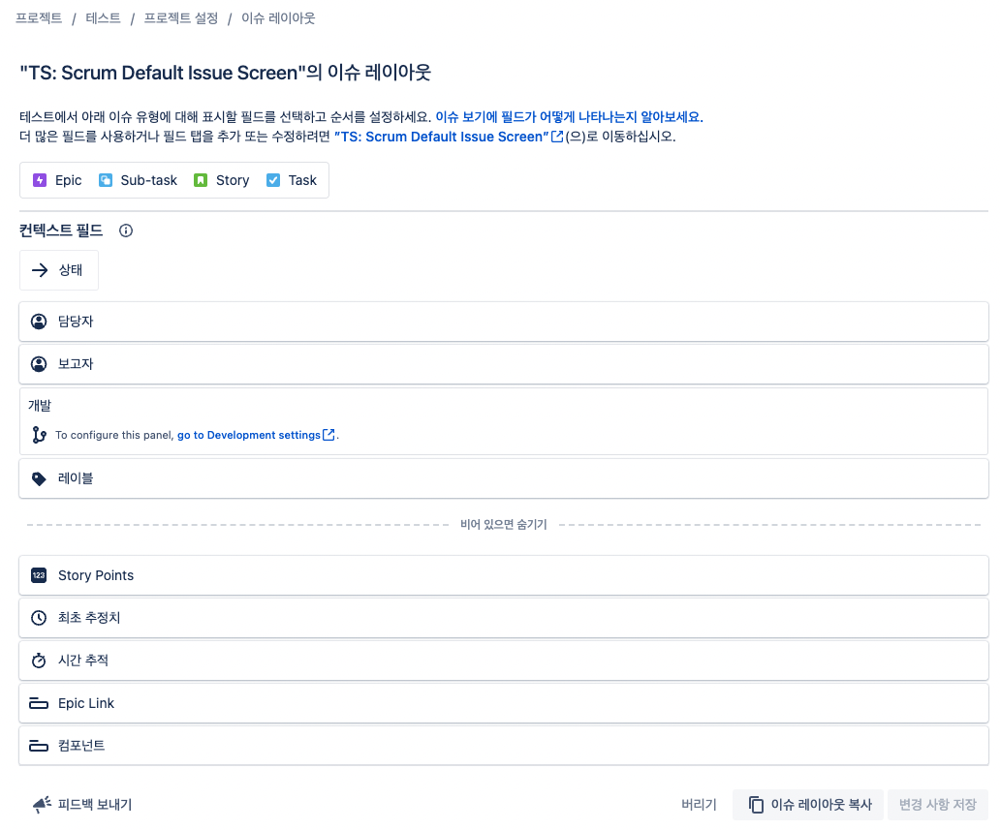

# 기본 세팅 - 세부 정보 필드 정리하기

- 아무 설정도 손 대지 않고 이슈를 생성하면, 이슈 상세에 위와 같은 정보를 확인할 수 있다.
- 스토리 포인트 설정, 일정 등을 입력하고 싶어서 필드 조정을 하기로 함.
- 우측 하단 `구성` 클릭

- 하단에 있는 필드 중 필요한 것들을 위로 드래그 앤 드랍
- 근데 시작 날짜, 종료 날짜 필드가 없어서 추가해야 한다.

- 오른쪽 리스트에서 `이슈 > 화면` 클릭
- 기본값으로 되어 있는 화면 구성의 연필 모양 아이콘 클릭

- 화면 구성 이름 클릭 (이름은 다를 수 있다)

- 하단 input 검색창에 필요한 필드 검색해서 클릭

- 이렇게 추가가 된다.
- 다시 티켓으로 돌아가보자.

- 설정한 필드가 모두 보이고 start date, target date 도 정상적으로 추가되었다.
