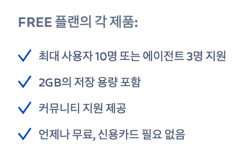
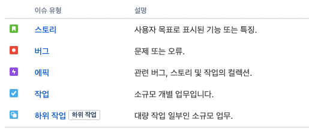
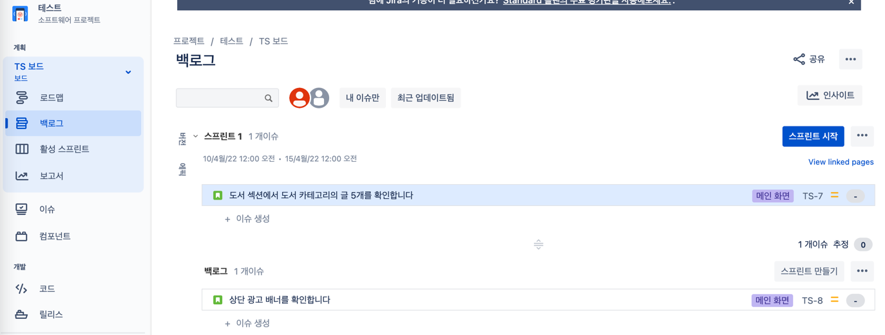
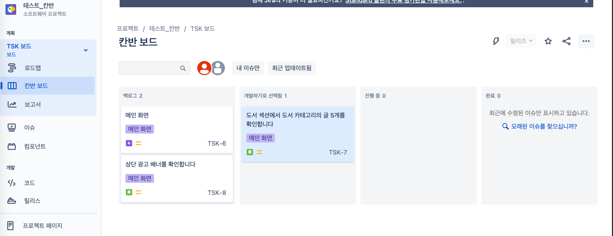

# 개념 정리하기 & 기본 세팅 체크리스트
- 현재 팀에서 노션을 사용하다가 팀원들의 강렬한 니즈로 지라를 도입하게 됐다.
- 내가 첫 세팅을 맡기로 함.
- 언제 다시 하게 될지 모르는데 기왕 하는 거 정리해놓자 싶어서 시작하는 시리즈.
- 테스트에는 무료판 사용할 예정.
- 

---

# 👉 개념 정리하기
# 이슈 유형

| 유형               | 설명                                           |
|------------------|----------------------------------------------|
| 에픽 (Epic)        | 업무의 큰 덩어리. 여러 story 또는 task의 집합.             |
| 스토리 (Story)      | 비즈니스 언어로 작성한, 유저 관점의 요구 사항.                  |
| 작업 (Task)        | 개발자가 실제 작업해야 하는 단위.                          |
| 하위 작업 (Sub-task) | 스토리나 작업의 하위 작업.   개발자가 실제 작업해야 하는 세부 단위. |
| 버그 (Bug)         | 버그, 이슈                                       |

# 프로젝트 템플릿
## 스크럼
- 에픽, 스토리, 버그, 작업, 하위 작업
- 해야 할 일 → 진행 중 → 완료
- #### Sprint 단위로 일감 관리

## 칸반
- 에픽, 스토리, 버그, 작업, 하위 작업
- 해야 할 일 → 진행 중 → 완료
- #### 모든 일감이 보드에 표시됨

## 버그 추적
- 에픽, 버그, `개선`, `새 기능`, 작업, 하위 작업
- 해야 할 일 → 진행 중 → `검토 중` → 완료

---

# 👉 기본 세팅 체크리스트
아래 체크리스트를 가지고 시리즈로 글을 작성해보겠다.

- [X] ~~프로젝트 유형 정하기~~ (생략)
- [X] ~~프로젝트 이름, 코드 정하기~~ (생략)
- [ ] 세부 정보 필드 정리하기
- [ ] 워크플로 정리
- [ ] 깃헙 연동
- [ ] 슬랙 연동
- [ ] IntelliJ 연동
- [ ] 이슈 유형 사용 규칙 정하기
- [ ] 티켓 작성 규칙 정하기
- [ ] 스프린트 규칙 정하기
- [ ] 팀 멤버 초대, 권한 부여
