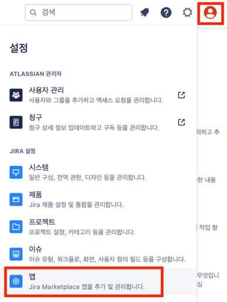
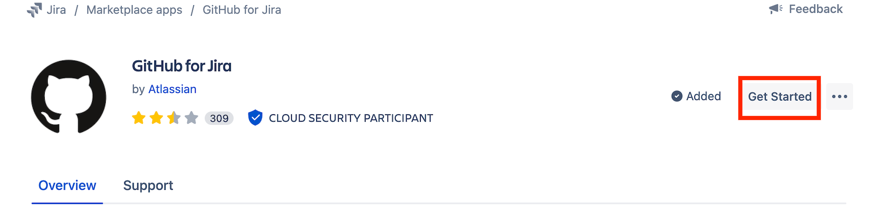
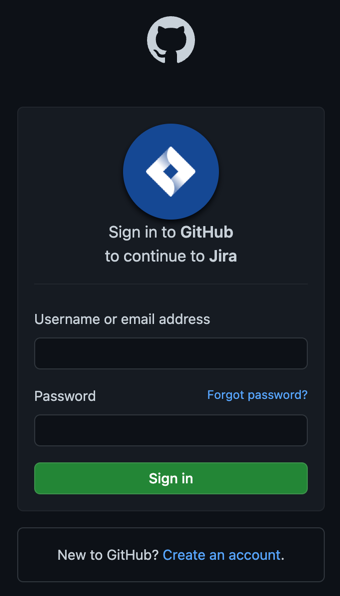
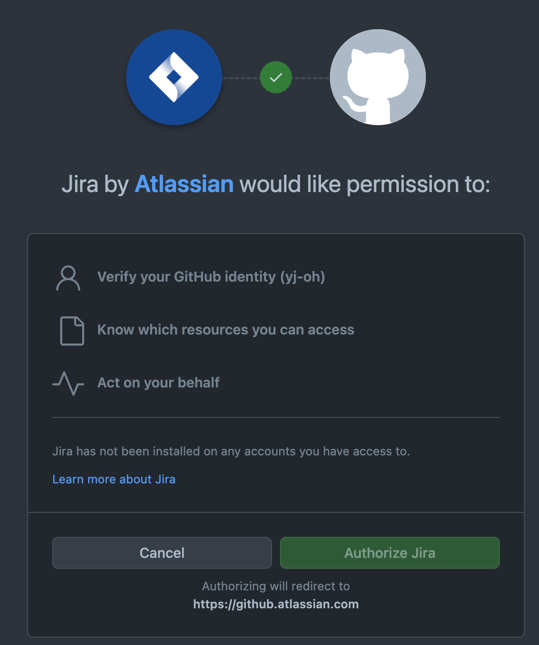
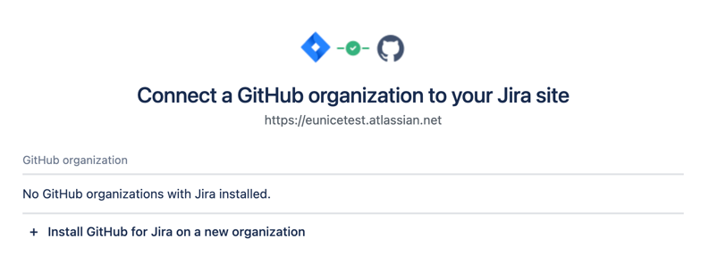
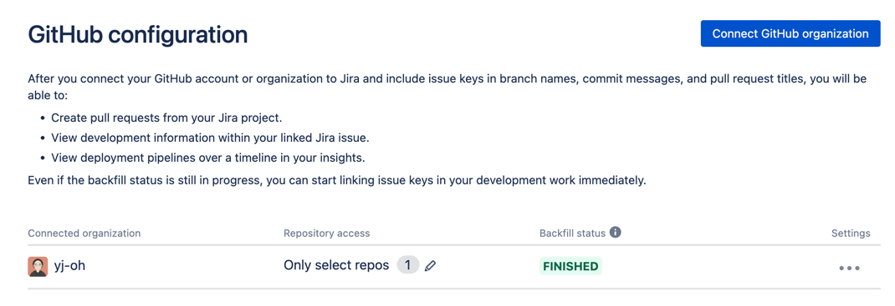

# 기본 세팅 - 깃헙 연동

- GitHub 검색

- 무료인 `GitHub for Jira` 연동한다.
- 클릭해서 `Get app` 버튼 클릭

- `Get started` 클릭

- `Connect GitHub organization` 클릭

- Sign in

- Authorize Jira

- `+ Install GitHub for Jira on a new organization` 클릭
- 연결하길 원하는 organization 선택

- 연결된 모습
- 브랜치에 티켓 코드를 넣으면 세부정보 > 개발에서 내용 확인 가능

 \

- 커밋 메시지에 티켓 코드를 넣어도 마찬가지. \

