# 기본 세팅 - IntelliJ 연동

## 단축키 요약
| 기능         | 단축키                   |
|------------|-----------------------|
| 티켓 목록 확인   | `option + shift + n`  |
| Commit     | `command + k`         |
| Push       | `command + shift + k` |
| Close task | `option + shift + w`  |

---

# 👉 IntelliJ 연동
- Action 검색 (`command + shift + a`) → servers 입력 \
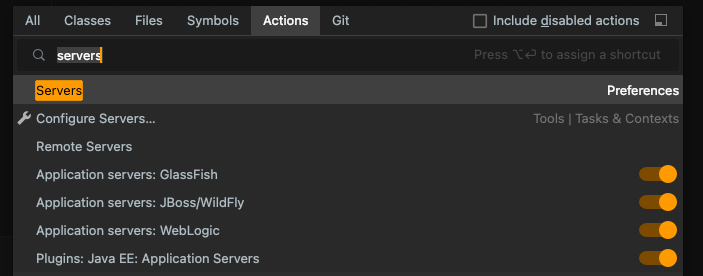

- `+` → `JIRA` 클릭 \
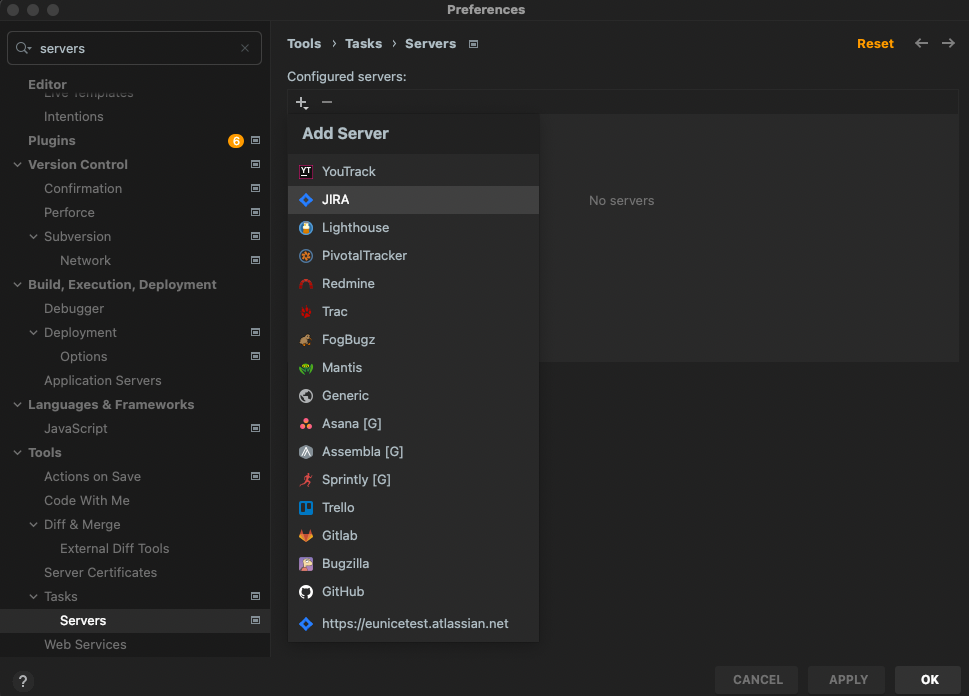

- Server URL, Email, API token(또는 password) 입력 \
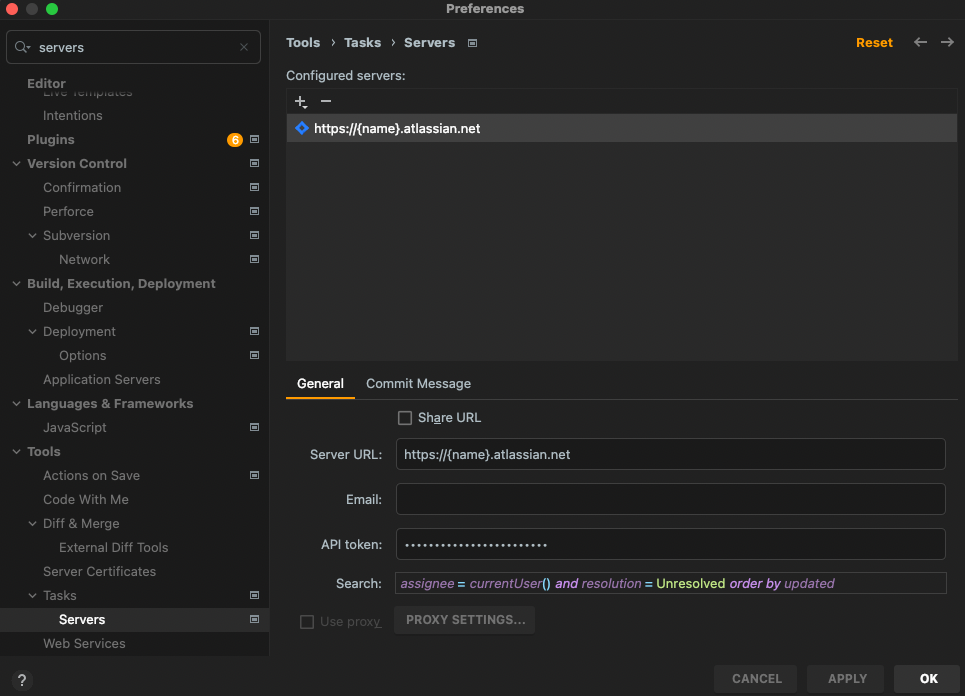

### ※ API token 발급받는 방법
- 지라 우측 상단 프로필 이미지 클릭 → 계정 설정 \
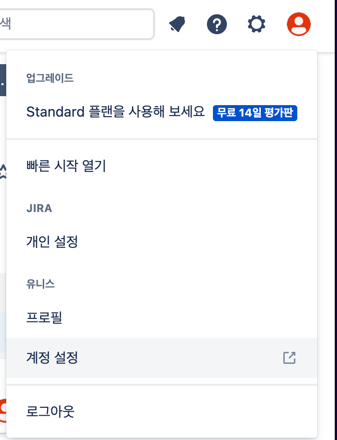

- 보안 → API 토큰 만들기 및 관리 \
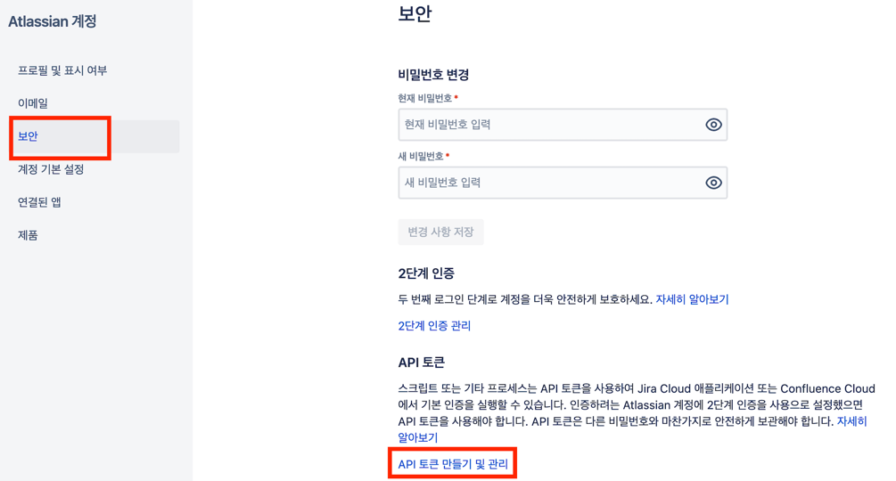
- 자기가 알아볼 수 있는 Label 설정하고 나오는 token 사용하면 된다.

---

# 👉 사용하기
## 1. 티켓 목록 확인하기 : `option + shift + n` \
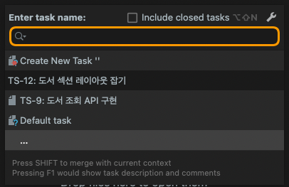
- 내가 담당자로 할당된 티켓들이 보인다.
- `TS-9 도서 조회 API 구현` 티켓을 작업해보자.

## 2. 작업하기
- 해당 티켓 클릭하면 아래와 같은 창이 뜬다. \
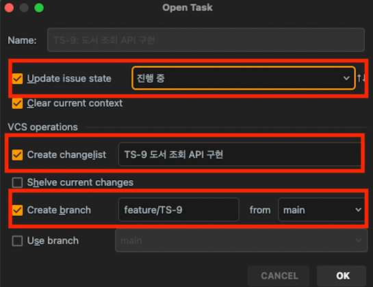
- 이름에 `TS-9`를 넣어 브랜치를 생성하고 issue state 를 `진행 중(IN PROGRESS)`으로 바꾸었다.
- 지라에서 확인해보자. \
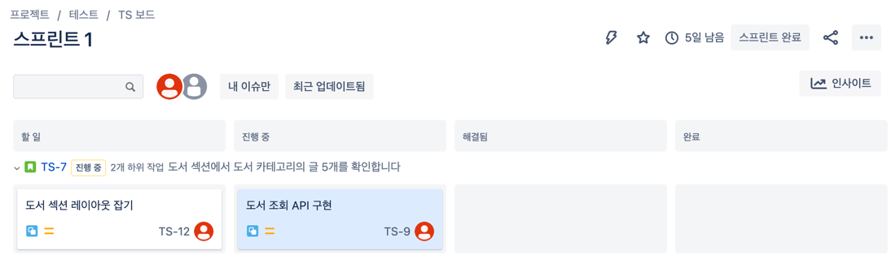 \

## 3. 커밋 & push 하기 : `command + k`
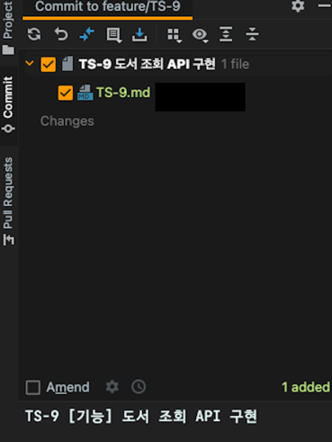
- 커밋 메시지가 자동으로 들어간다.
- commit & push 버튼 클릭

## 4. Close task
- `option + shift + w` \
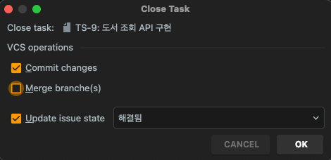
- issue 상태를 `해결됨(DONE)`으로 바꿔준다.
- push 하고 지라에서 확인해보자. \
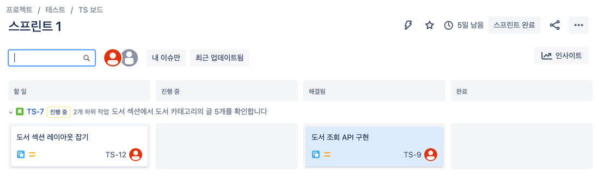

- 세부 정보에서 `개발`을 확인해보면 브랜치와 커밋 내역도 확인이 가능하다. \
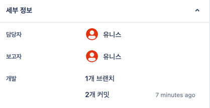 \
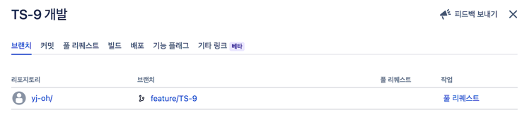 \
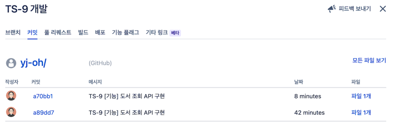

- IDE 우측 상단에서 task 를 변경할 수도 있다. \
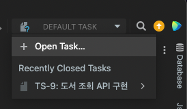
