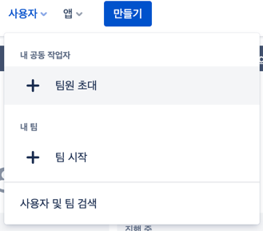
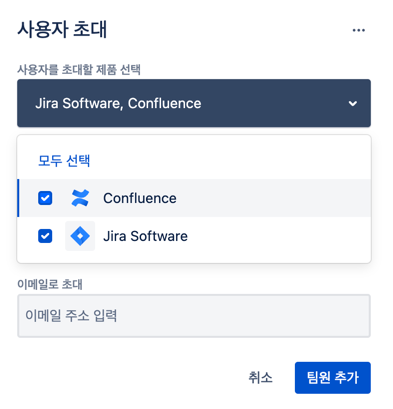
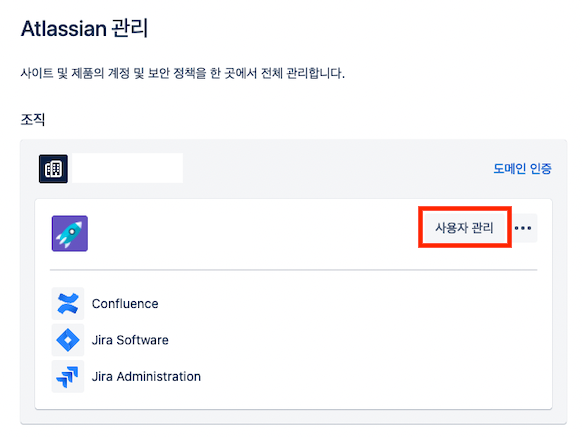
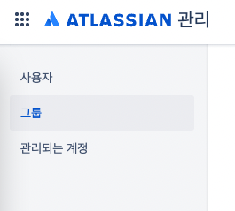
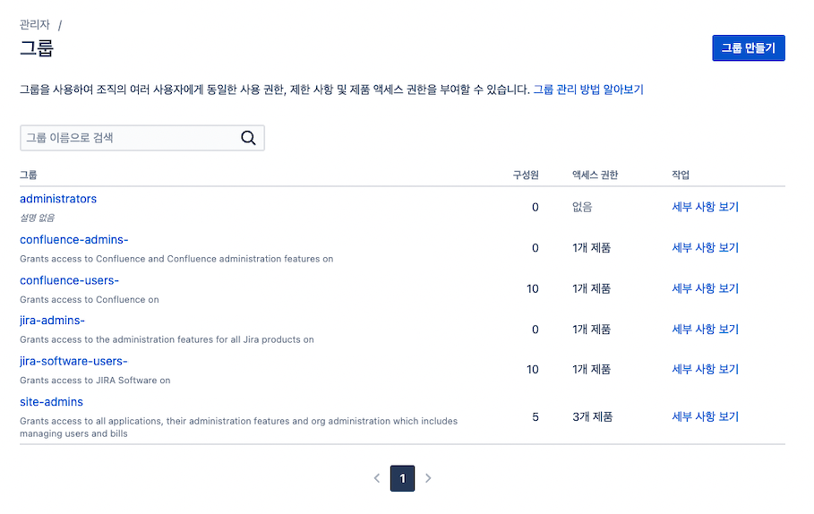

# 팀 멤버 초대, 권한 부여

# 👉 팀 멤버 초대
- 상단 `사용자 > 팀원 초대` 클릭 \

- 컨플루언스에도 함께 초대할 수 있다. \

# 👉 Admin atlassian
- https://admin.atlassian.com/ \

- 여기서도 사용자 초대 가능 \

- 왼쪽 메뉴 중 그룹을 클릭하면 각각의 제품에 대한 admin 권한, 사이트에 대한 admin 권한 부여할 수 있다. \
 \

