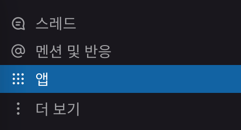
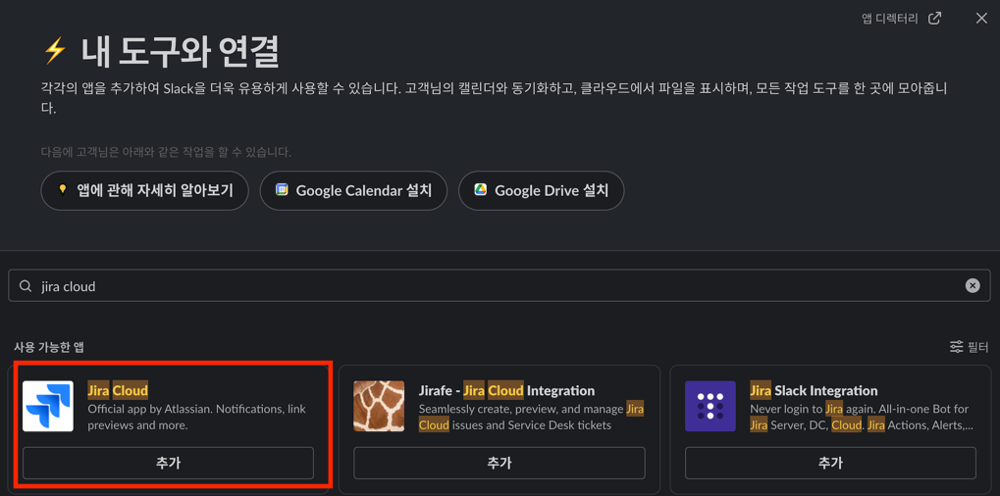
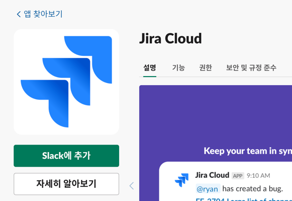
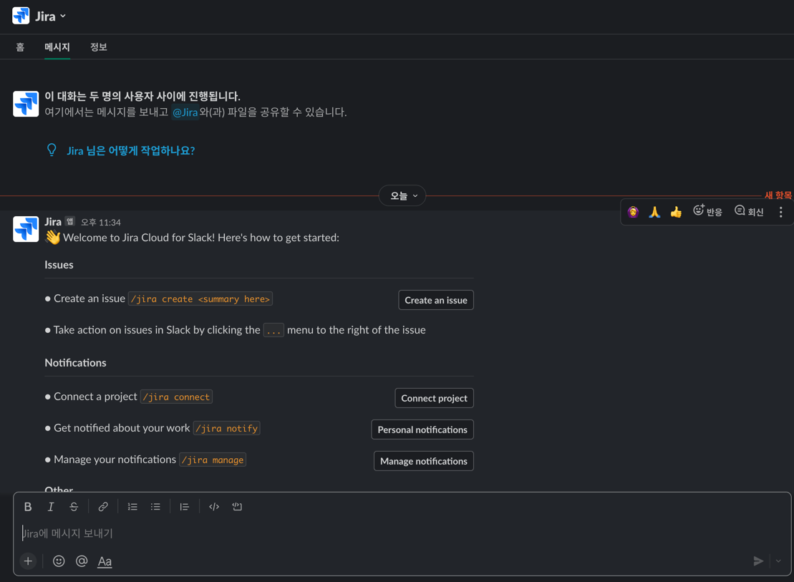
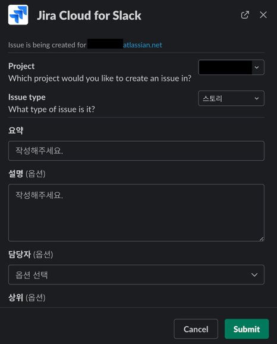
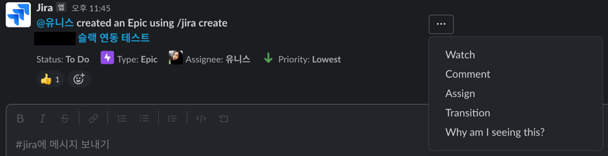

# 기본 세팅 - 슬랙 연동

# 👉 연동하기
- 좌측 상단 `앱` 클릭 \

- `jira cloud` 검색 및 추가 버튼 클릭 \

- `Slack에 추가` 버튼 클릭 \

- Atlassian 로그인 및 연동
- 슬랙에서 Jira App 확인 \

- `/jira connect` 메시지 입력
- 연결을 원하는 프로젝트 및 알림 받을 DM 또는 채널 선택

# 👉 사용하기
## 이슈 생성
- `/jira create` \

## Comment, Assign, Transition...

