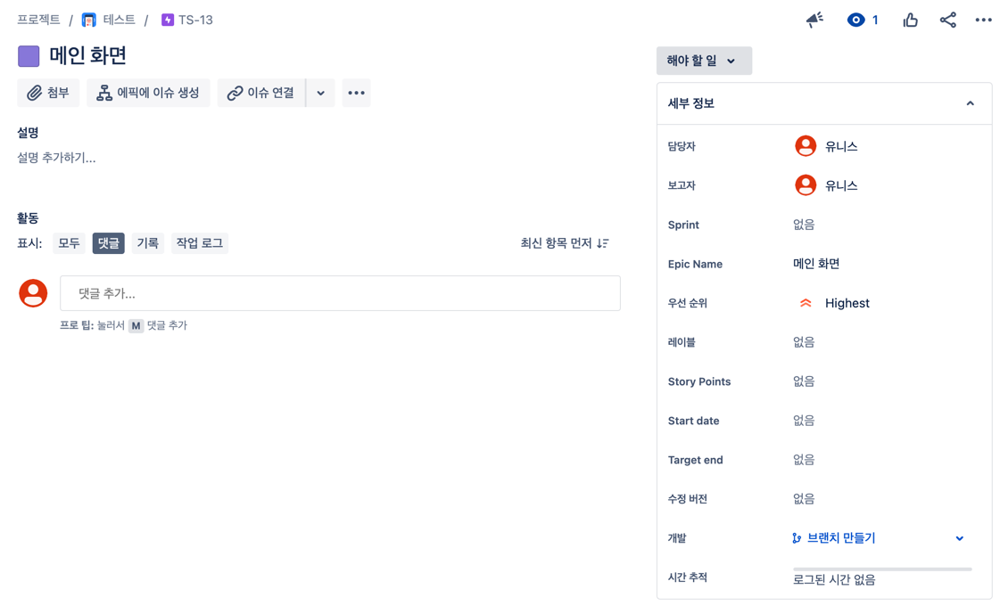
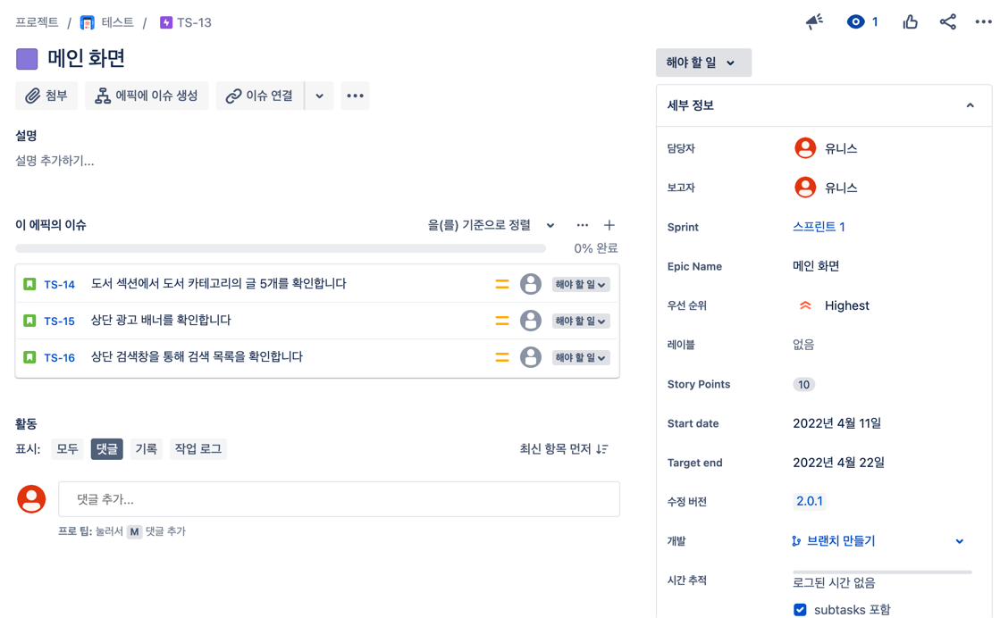
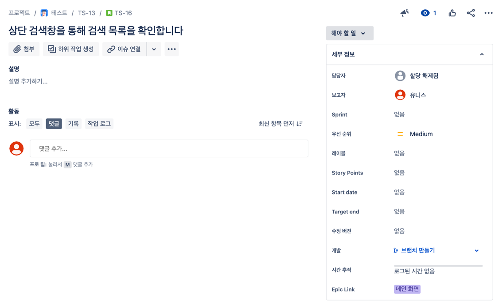
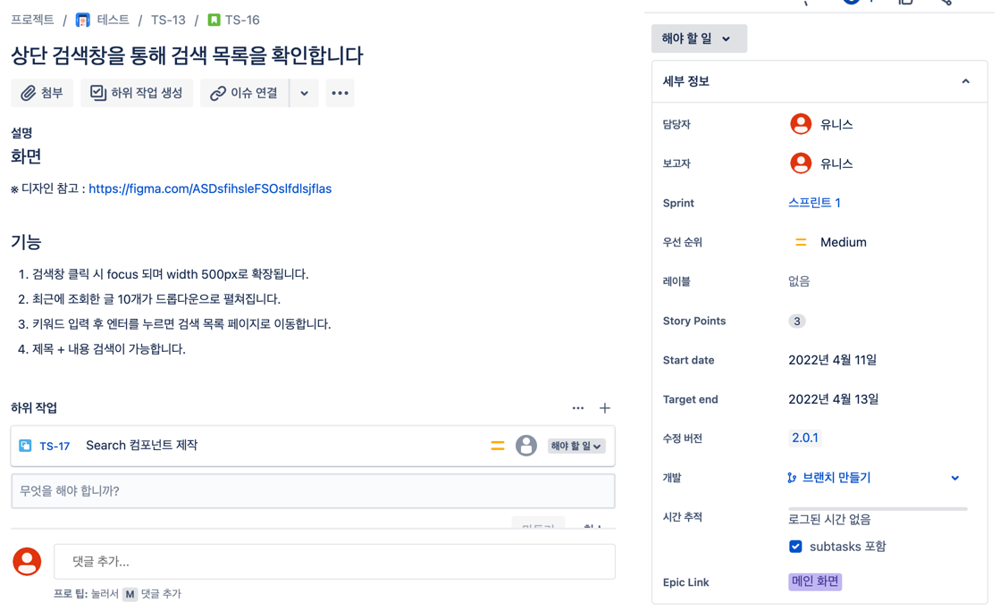

# 기본 세팅 - 티켓 작성 규칙 정하기

# 👉 에픽
## 초기 화면

### ✅ 필수 체크리스트
- [ ] 담당자를 할당합니다.
- [ ] 우선 순위를 지정합니다.
- [ ] 수정 버전을 지정합니다.
- [ ] 이슈를 생성합니다.

### ✅ 선택 체크리스트 
- [ ] 구체적인 설명을 작성합니다.
- [ ] 스프린트를 지정합니다.
- [ ] Story point 를 지정합니다.
- [ ] Start date 를 지정합니다.
- [ ] Target end 를 지정합니다.

## 작성 후 화면

# 👉 스토리 or 작업 or 하위 작업
## 초기 화면

### ✅ 필수 체크리스트
- [ ] 담당자를 할당합니다.
- [ ] 우선 순위를 지정합니다.
- [ ] 수정 버전을 지정합니다.
- [ ] Story point 를 지정합니다.

### ✅ 선택 체크리스트
- [ ] 구체적인 설명을 작성합니다.
- [ ] 스프린트를 지정합니다.
- [ ] Start date 를 지정합니다.
- [ ] Target end 를 지정합니다.
- [ ] 하위 작업을 생성합니다.

## 작성 후 화면

