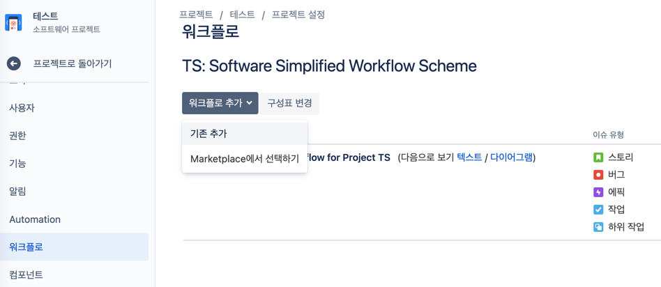

# 기본 세팅 - 워크플로 정리하기
- 기본 workflow \


## 기존에는 어떻게 일했지?
```text
- 기획서 기반 요구사항 분석
- 기능 정의 및 일정 산출
- 백로그에 티켓 일괄 등록
- 스프린트에 진행할 작업 할당
- 스프린트 시작
- 각각의 작업자가 티켓을 `진행 중` → `리뷰`로 이동
  - 기획자 및 QA가 `리뷰` 상태의 티켓을 대상으로 기본 테스트 진행
  - 결함 발견될 경우 코멘트 후 `할 일`로 되돌려보냄
  - 결함 발견되지 않을 경우 `완료` 처리 
- 종료 시점에 스프린트 회고 및 다음 스프린트 작업 할당
- 모든 에픽 종료까지 반복
- 본격 테스트 기간 시작되면 버그 추적 프로젝트 생성하여 그곳에서 플로우 진행
```
- 이를 기반으로 도출된 워크플로
  - `TODO` : 할 일
  - `IN PROGRESS` : 개발 중
  - `REVIEW` : 개발 완료
  - `DONE` : 개발 및 테스트 완료 (종료)

## 우리는 어떻게 일하지?
```text
...🤔❓
```
- 레거시를 옮기는 단계의 지금과, 새로운 기능을 개발하는 미래는 또 다를 것.
- 어쨌든 두 가지 선택지.
  1. `RESOLVED` 단계를 넣어서 개발 당사자가 발견하지 못하는 자잘자잘한 이슈를 미리 해결하고 최종 테스트 시 버그 발생률을 줄인다.
  2. `RESOLVED` 단계를 두지 않고 개발 다 되면 무조건 완료 처리한 뒤 추후 테스트에서 버그로 넘긴다.
- 이름을 QA or TEST 로 지정해도 좋을 듯?

## Custom Workflow 생성
- 우선 전역으로 등록해줘야 한다.


- 최상단 톱니바퀴 설정 버튼 클릭
- 이슈 클릭


- 좌측 워크플로 - 우측 워크플로 추가 - 새로 만들기
- 이름 입력


- 상태 추가, 전환 추가를 이용해서 워크플로 다이어그램 그릴 수 있다.


## Custom Workflow 등록


- 워크플로를 설정하려는 프로젝트의 설정으로 들어간다.



- 워크플로 - 워크플로 추가 - 기존 추가 클릭


- 전역으로 등록해주었던 `TEST2`가 보인다. 클릭. 다음.


- 워크플로를 따라갈 이슈 유형 선택 - 완료


- 워크플로가 `TEST2`로 변경되었다.
- 상단 임시본 `게시` 클릭
- 좌측 목록 상단 `프로젝트로 돌아가기` 클릭


- 활성 스프린트 수정을 해주자.


- 우측 점 세 개 아이콘 - 보드 설정 클릭


- 우측 열추가 버튼 클릭


- `해결됨` 추가하고 워크플로를 드래그 앤 드랍으로 매칭해주었다.
- 잘 적용되었는지 다시 활성 스프린트로 돌아가보자.


- 굳!
