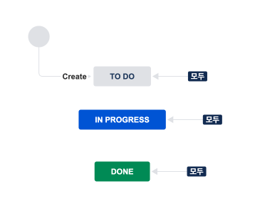
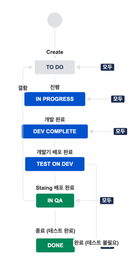

# 워크플로에 대한 고민
- 참고 : [기본 세팅 - 워크플로 정리하기](_20220407_workflow.md)

---

## 기본 워크플로

### 문제점
- QA가 필요한 이슈와 QA를 끝낸 이슈를 구분하지 못함.

## 수정한 워크플로

### 문제점
- Dev 서버 배포와 Staging 서버 배포를 구분하지 못함.
- 작업자 개개인의 디테일한 작업 상황 추적 불가능.

### 고민되는 지점
- 개발자 개개인의 작업 상황을 오픈하는 것이 옳은가?
- 소규모의 팀에도 효율적일 것인가?
- 불필요한 노이즈를 불러일으키지 않을까?

### 장점
- 조금 더 디테일한 상태 관리 가능
- 여러 사람이 협업할 때 유용
- 나 같은 사람이 속 시원함

### 단점
- 불필요한 업무 늘리기
- 소규모의 팀에서 투머치
- 누군가에게는 불필요한, 업무를 위한 업무

## 팀에 제안할 워크플로

- Dev Complate (개발 완료) 단계 추가

### 장점
- Dev 배포와 Staging 배포를 분리
- PR 리뷰가 오기 전에 작업자 개개인의 작업 상황 파악 가능

### 문제점
- 소규모의 팀에 불필요

## 내가 생각하는 이상적인 워크플로

### 생각
- 개발자의 테스트와 QA가 분리되어야 유용하겠다.
  - 그렇지 않으면 불필요한 노이즈가 될 수 있음.
  - 개발자가 개발하고 배포하고 테스트 하고 하는 환경에서는 불필요
- QA가 있으면 좋겠다.😇 (트래픽을 늘리고 서비스 규모를 확장하자!)
